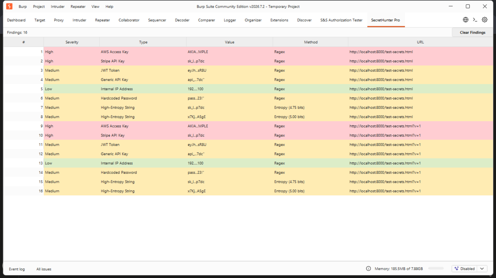
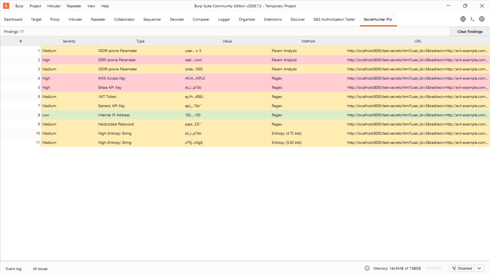
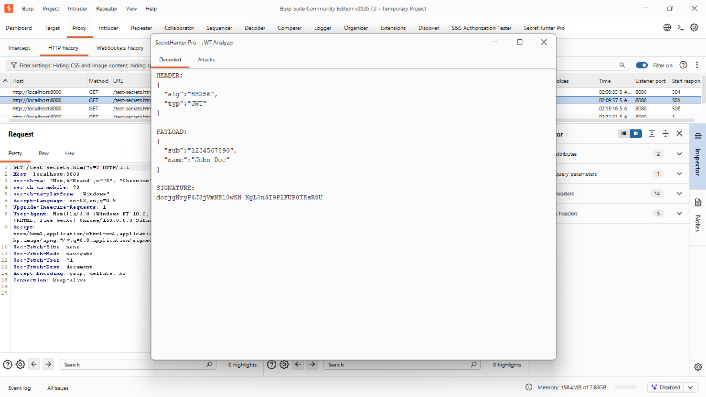
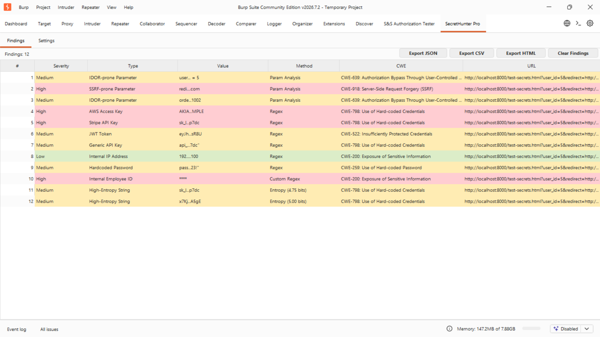
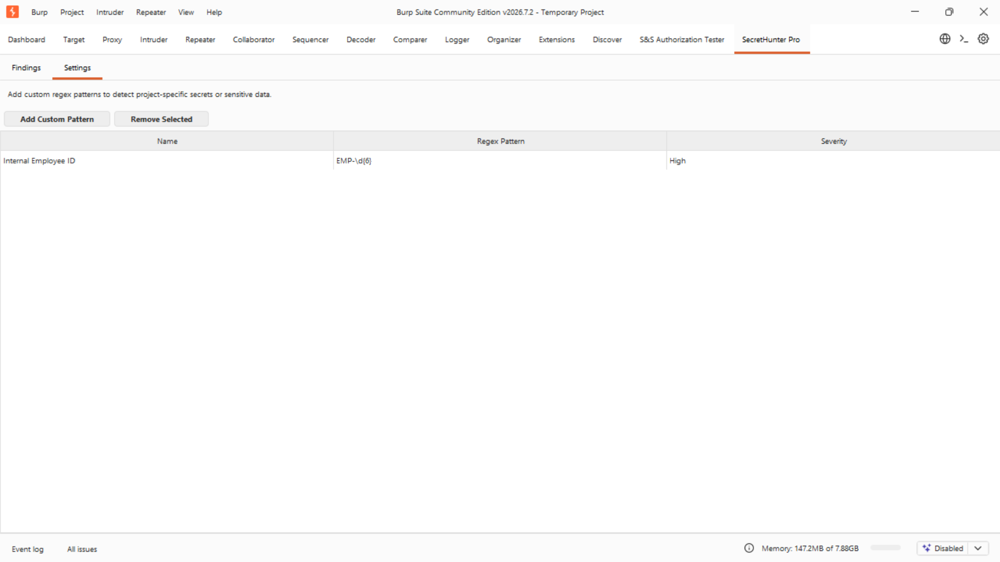
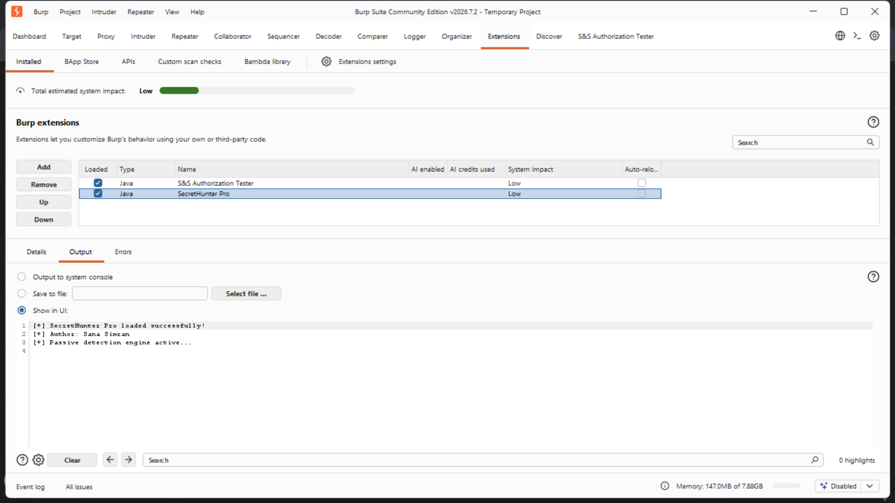

# SecretHunter Pro

An advanced Burp Suite extension (Java / Montoya API) that passively hunts for leaked secrets, risky parameters, and vulnerable JWTs in HTTP traffic — with entropy-based detection, an active JWT attack module, a custom colour-coded findings dashboard, and S&S-branded JSON/CSV/HTML reporting.

## Overview

Manually grepping through Burp's proxy history for leaked API keys, tokens, and risky parameters doesn't scale. This extension automates the full triage pipeline a pentester or AppSec engineer would run against every response in scope:

1. **Passively scan every HTTP response** — regex-based detection across 10+ secret types (AWS keys, Stripe keys, GitHub tokens, JWTs, private keys, hardcoded passwords) plus **Shannon entropy analysis** to catch unknown/custom secret formats that regex alone would miss
2. **Analyze every request parameter** for IDOR-prone object references (`user_id`, `order_id`) and SSRF-prone URL-fetching parameters (`redirect`, `callback`, `webhook`)
3. **Decode and attack JWTs** directly from the request/response editor — `alg=none` bypass generation and weak-secret HMAC brute-forcing, via a right-click context menu
4. **Surface everything in a dedicated Burp tab** — a colour-coded, sortable findings table with CWE mapping, right-click "copy" / "mark as false positive," and one-click JSON/CSV/HTML report export
5. **Extend detection at runtime** — a built-in Settings panel lets you add project-specific custom regex patterns without touching code or reloading the extension

Every feature below was tested end-to-end against a local lab (Python `http.server` test pages + live Burp proxy traffic), not synthetic unit-test data alone — the passive/active detection is proven against real HTTP request/response cycles captured in Burp.

**Environment:**
- Platform: Windows 11 + VS Code
- Target: Burp Suite Community Edition v2026.7.2
- API: PortSwigger Montoya API 2023.12.1
- Build: Maven (Java 17, maven-shade-plugin for a single deployable JAR)

## Feature Coverage — 5/5

| # | Feature | Technique | Result |
|---|---------|-----------|--------|
| 1 | Passive Secret Detection | Regex (10+ patterns) + Shannon entropy analysis | 8+ secret types detected per response |
| 2 | IDOR/SSRF Parameter Analysis | Name + value heuristics on every outgoing request | High/Medium risk parameters flagged in real time |
| 3 | JWT Analyzer | Base64URL decode, `alg=none` generation, HMAC-SHA256 brute-force | Header/payload decoded, forgeable tokens identified |
| 4 | Findings Dashboard | Custom Swing UI (JTable), CWE-mapped, colour-coded by severity | Centralized, filterable view of all findings |
| 5 | Reporting & Config | JSON/CSV/HTML export, runtime custom regex patterns | S&S-branded report; extensible without rebuilding |

## Setup

```bash
git clone https://github.com/sanasimran1403-jpg/secrethunter-pro.git
cd secrethunter-pro
mvn clean package
```

Load into Burp: **Extensions → Installed → Add → Extension type: Java → select `target/secrethunter-pro.jar`**

## Usage

Once loaded, SecretHunter Pro runs passively in the background on all proxied traffic — no configuration needed to start finding secrets and risky parameters.

- **Findings tab**: view, sort, export, or dismiss findings as they're discovered
- **Settings tab**: add custom regex patterns specific to your target application
- **Right-click any request/response containing a JWT** → *Send to SecretHunter JWT Analyzer*

## 1. Passive Secret Detection

**Detection logic:** every HTTP response body is scanned with two complementary engines — a curated regex library (AWS/Stripe/GitHub/Google/Slack keys, JWTs, private key headers, hardcoded passwords, internal IPs) and a Shannon entropy analyzer that flags high-randomness strings regex patterns don't cover, filtering out low-entropy false positives like repeated characters or common hashes.

**Result:**

```
[High]   AWS Access Key          (Regex)              — AKIA...MPLE
[High]   Stripe API Key          (Regex)              — sk_l...p7dc
[Medium] JWT Token                (Regex)              — eyJh...sR8U
[Medium] Generic API Key          (Regex)              — api_...7dc
[Low]    Internal IP Address      (Regex)              — 192....100
[Medium] Hardcoded Password       (Regex)              — pass...23!
[Medium] High-Entropy String      (Entropy 4.75 bits)   — sk_l...p7dc
[Medium] High-Entropy String      (Entropy 5.00 bits)   — x7Kj...A5gE
```



## 2. IDOR / SSRF Parameter Analysis

**Detection logic:** every outgoing request's parameters are checked against two pattern sets — known object-reference parameter names (`user_id`, `order_id`, `account_no`, etc.) paired with numeric values flag as **IDOR-prone**; known URL-fetching parameter names (`redirect`, `callback`, `webhook`, `url`) or values that look like URLs/hostnames flag as **SSRF-prone**. This runs entirely client-side in the extension — no dependency on Burp Scanner, so it works on Community Edition.

**Result:**

```
[Medium] IDOR-prone Parameter — user_id = 5
[High]   SSRF-prone Parameter — redirect = http://evil-example.com
[Medium] IDOR-prone Parameter — order_id = 1002
```



## 3. JWT Analyzer

**Command:** right-click any request or response containing a JWT → *Send to SecretHunter JWT Analyzer*

**Attack logic:**
- Decodes header, payload, and signature from the raw Base64URL segments
- Generates three `alg=none` variants (`none` / `None` / `NONE` — some servers only case-match) with a stripped signature, ready to paste into Repeater to test for signature-verification bypass
- Brute-forces the HMAC-SHA256 signature against a wordlist of common weak secrets, signing the *raw* header/payload segments (not re-encoded JSON) to guarantee byte-for-byte signature matching

**Result:**

```
HEADER:  { "alg": "HS256", "typ": "JWT" }
PAYLOAD: { "sub": "1234567890", "name": "John Doe" }

=== alg=none Attack Variants ===
eyJhbGciOiJub25lIiwidHlwIjoiSldUIn0...
eyJhbGciOiJOb25lIiwidHlwIjoiSldUIn0...
eyJhbGciOiJOT05FIiwidHlwIjoiSldUIn0...

=== Weak Secret Brute-Force (HMAC-SHA256) ===
Testing 15 common secrets...
No match found in default wordlist (15 entries).
```



## 4. Findings Dashboard

**UI logic:** a dedicated "SecretHunter Pro" Burp suite tab hosts a sortable `JTable` fed in real time by the passive scanner. Rows are colour-coded by severity (red/orange/green), right-click gives *Copy value*, *Copy URL*, and *Mark as False Positive* (removes and renumbers), and every finding is auto-mapped to a relevant CWE ID.

**Result:** 12 findings across secrets, IDOR/SSRF risk, and a custom pattern — all in one filterable view.



## 5. Reporting & Runtime Configuration

**Export logic:** the findings table can be exported to JSON (machine-readable), CSV (spreadsheet-friendly), or a self-contained HTML report — dark navy theme, embedded S&S logo, risk score/level summary box, and CWE-mapped findings table, styled to match S&S's internal reporting format.

**Config logic:** the Settings tab lets you add a name + Java regex + severity for any project-specific secret format (e.g. an internal employee ID scheme). Patterns are validated on add (`Pattern.compile` inside a try/catch) and immediately picked up by the passive scanner — no rebuild or reload required.

**Result:**

```
Name: Internal Employee ID
Regex: EMP-\d{6}
Severity: High
→ employee_id = "EMP-482913" flagged on next response scan
```





## Repository Structure

```
secrethunter-pro/
├── pom.xml
├── src/
│   ├── main/
│   │   ├── java/
│   │   │   └── com/sanasimran/secrethunter/
│   │   │       ├── SecretHunterExtension.java   # entry point, registers all handlers
│   │   │       ├── model/
│   │   │       │   ├── SecretMatch.java
│   │   │       │   └── CweMapper.java
│   │   │       ├── detectors/
│   │   │       │   ├── PatternDetector.java     # regex + custom pattern engine
│   │   │       │   └── EntropyAnalyzer.java     # Shannon entropy scoring
│   │   │       ├── scanner/
│   │   │       │   ├── PassiveSecretScanner.java  # HttpHandler — request+response hook
│   │   │       │   └── ParameterRiskDetector.java # IDOR/SSRF heuristics
│   │   │       ├── jwt/
│   │   │       │   ├── JwtParser.java
│   │   │       │   ├── JwtAttacker.java          # alg=none + brute-force
│   │   │       │   ├── JwtAnalyzerDialog.java
│   │   │       │   └── WordlistLoader.java
│   │   │       ├── ui/
│   │   │       │   ├── SecretHunterTab.java
│   │   │       │   ├── FindingsTableModel.java
│   │   │       │   ├── SettingsPanel.java
│   │   │       │   └── SecretHunterContextMenu.java
│   │   │       ├── config/
│   │   │       │   └── CustomPatternStore.java
│   │   │       └── report/
│   │   │           └── ReportExporter.java       # JSON/CSV/HTML generation
│   │   └── resources/
│   │       ├── wordlists/jwt-secrets.txt
│   │       └── images/sns-logo.png
│   └── test/
│       └── java/com/sanasimran/secrethunter/
│           ├── detectors/PatternDetectorTest.java
│           ├── detectors/EntropyAnalyzerTest.java
│           ├── jwt/JwtParserTest.java
│           └── scanner/ParameterRiskDetectorTest.java
└── screenshots/
```

## Tech Stack

| Tool | Version | Purpose |
|------|---------|---------|
| Java | 17 | Core language |
| Montoya API | 2023.12.1 | Burp Suite extension framework |
| Maven | 3.9.16 | Build + dependency management |
| maven-shade-plugin | 3.5.1 | Single deployable fat JAR |
| JUnit Jupiter | 5.10.0 | Unit testing |
| Mockito | 5.14.2 | Mocking Montoya API interfaces in tests |
| Java Swing | built-in | Custom findings dashboard + Settings UI |

## Key Learnings

- Building a passive detection engine that layers **regex signatures and entropy analysis** to catch both known secret formats and unknown/custom ones — the same technique tools like TruffleHog use
- Implementing JWT attacks (`alg=none`, HMAC brute-force) correctly requires signing the **raw Base64URL segments**, not re-encoded JSON — re-encoding changes whitespace/key ordering and silently breaks signature matching
- Working around Burp Community Edition's locked Scanner/`AuditIssue` API by building IDOR/SSRF detection as a fully custom `HttpHandler`-based pipeline instead — kept the extension free-tier compatible without losing functionality
- Designing a runtime-extensible detection engine (`CustomPatternStore`) so users can add new secret patterns from the UI without recompiling or reloading the extension
- Generating a branded, professional HTML report (embedded base64 logo, dark theme, CWE mapping) entirely from a Java `StringBuilder` — no external templating library needed

## Known Limitations

- Passive detection only scans response **bodies**; secrets exposed exclusively in non-standard headers are not yet covered
- The JWT weak-secret brute-force wordlist is a small curated list (15 entries) — not a full SecLists-scale wordlist
- IDOR/SSRF detection is heuristic (name + value pattern matching), not confirmed via active exploitation — findings are leads for manual verification, not proven vulnerabilities
- Entropy analysis can produce false positives on long non-secret random-looking strings (e.g. session IDs, cache-busting tokens) — the "Mark as False Positive" action exists specifically to triage these

## Author

Sana Simran
GitHub: [@sanasimran1403-jpg](https://github.com/sanasimran1403-jpg)

**Disclaimer:** This tool is intended for authorized security testing and defensive research only. Only run SecretHunter Pro against applications and environments you own or have explicit permission to test.
